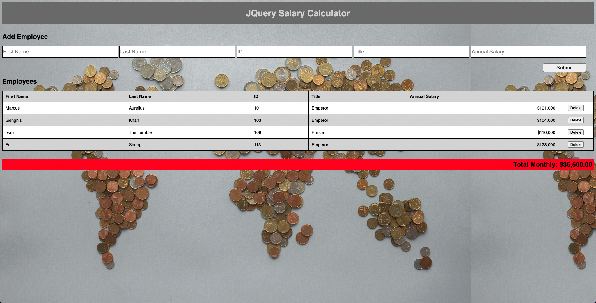

# Jquery Salary Calculator

## Heroku Link

[Jquery Salary Calculator](https://jquery-calculator-1.herokuapp.com/)

## Description

This is a web app designed to take in employee information and display it on the DOM in an organized table. The overall monthly salaries for all employees are calculated at the bottom of the page. Once the total monthly salaries exceed $20,000.00, the background color of this calculation turns red. You can add/remove employees as you wish.

## Interface

## Languages

JavaScript, CSS, HTML, and Markdown demonstrated.

## Packages

This is built with only jQuery utilized.

## Future Updates

No future updates planned.
